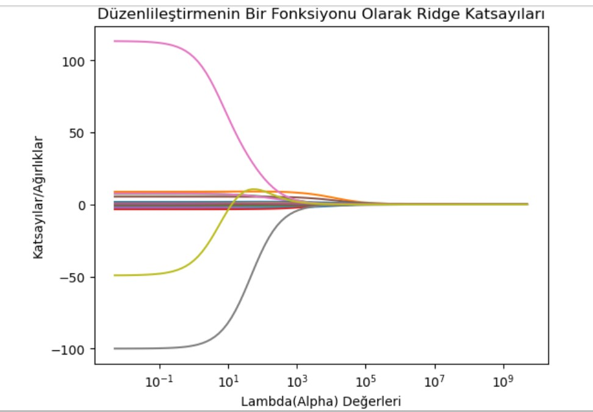

# 💻 Tech Stack:
 
# 📊 GitHub Stats:
 
 

## 🏆 GitHub Trophies

### ✍️ Random Dev Quote

### 🔝 Top Contributed Repo

## About Me

Hello, I'm Osman Kağan Gündüz. I'm a software developer and data science enthusiast. I studied [Statistics] at [Yıldız Technical University]. I am familiar with various technologies such as [Python, Studio R].

### My Experience

* [Company/Project Name] - [Position] ([Date Range])
  * [Your duties and achievements]
* [Project Name] - [Your Role] ([Date Range])
  * [Information about the project and the technologies you used]

### My Skills

* Programming Languages: [List]
* Databases: [List]
* Cloud Platforms: [List]
* Other: [List]

### Contact

* E-posta: [kagan_osman@hotmail.com]
* LinkedIn: [LinkedIn profile]
* Twitter: [Twitter profile]

## Projects

### StatGenius

*Description*: A tool for statistical analysis.
*Technologies*: Python, NumPy, Pandas
*Link*: [GitHub repo link]

### [Project Name]

*Description*: [Project description]
*Technologies*: [List]
*Link*: [Project link]

### DeepSeek vs ChatGPT: Complete Comparison of the AI Titans in 2025

(https://www.geeksforgeeks.org/deepseek-vs-chatgpt/)
